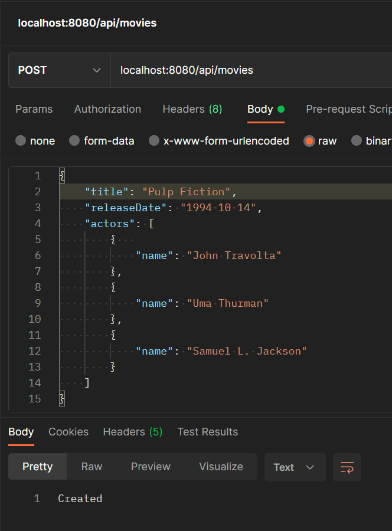
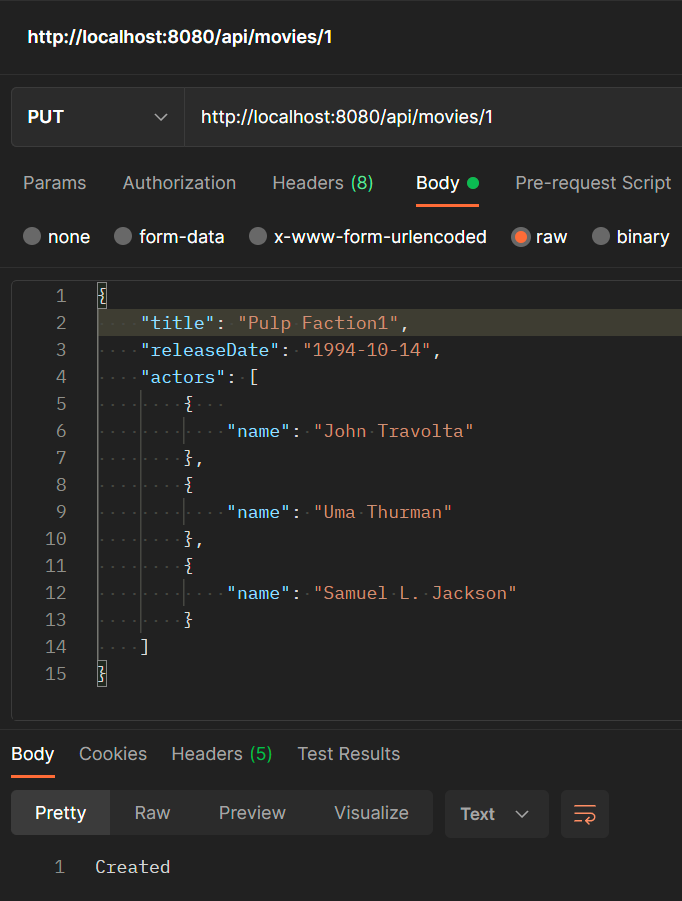
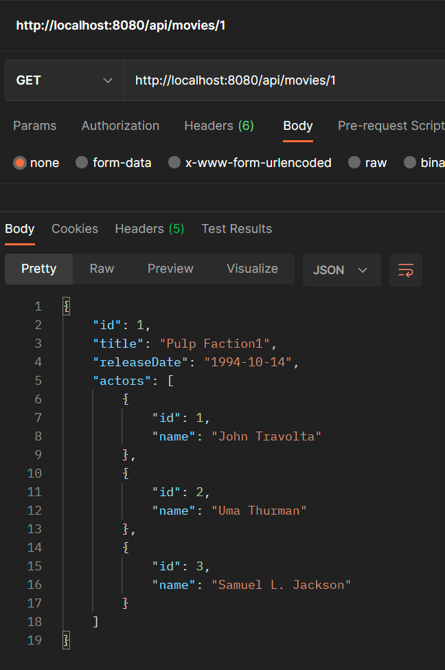
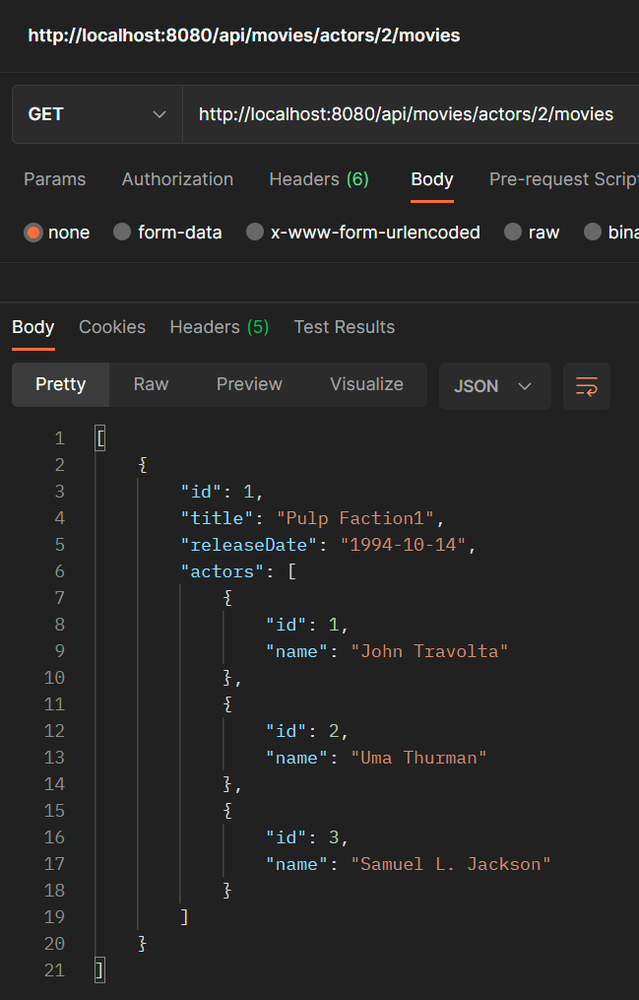
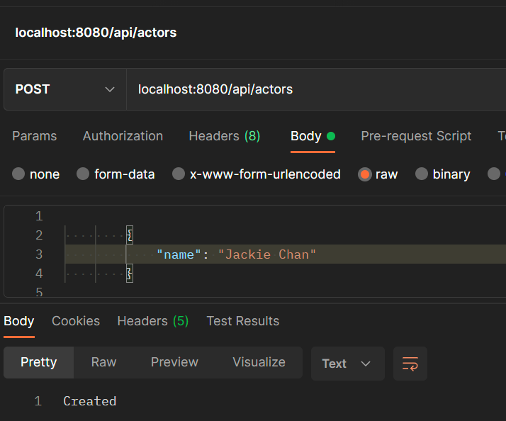
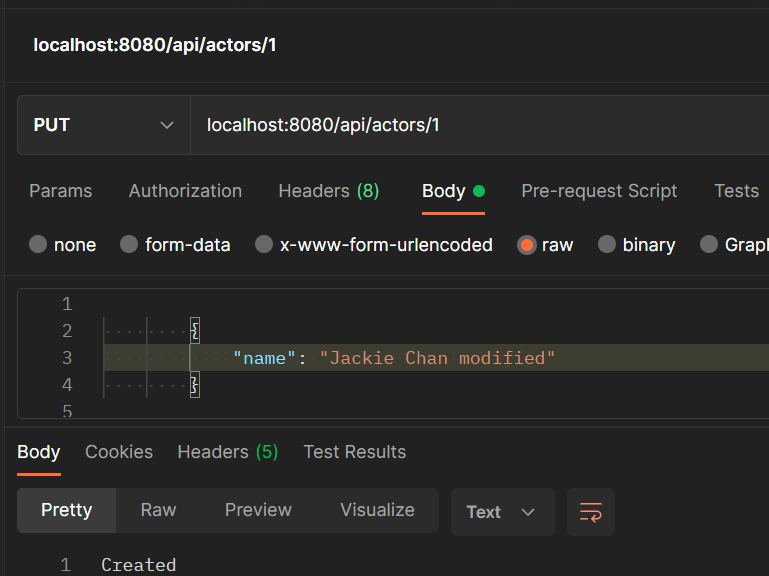
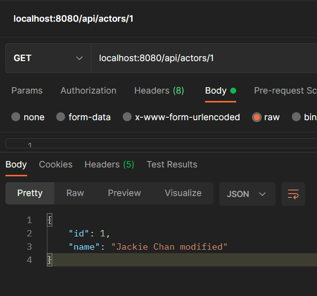

 
 
 # Movie Information application

This is a spring boot application that performs CRUD operations on a movie database. This database has a movie that contains titile, release date, a list of actor and a separate table for actors.

Environment:

 jdk: coretto-17.0.6 

 db: H2

Note: Since it's an in memory database. Tables will not have data initially. Insert seed data via the post movies endpoint. Example listed below

# Endpoints and sample payloads:

db console endpoint: http://localhost:8080/h2-console

# Post movies endpoint: localhost:8080/api/movies 

# Put movies endpoint: localhost:8080/api/movies/1

# Get movies endpoint: localhost:8080/api/movies/1

# Get movies actor are in endpoint:http://localhost:8080/api/movies/actors/2/movies

# Post actors endpoint: localhost:8080/api/actors

# Update actors endpoint: localhost:8080/api/1

# Get actors endpoint: localhost:8080/api/actors/1

